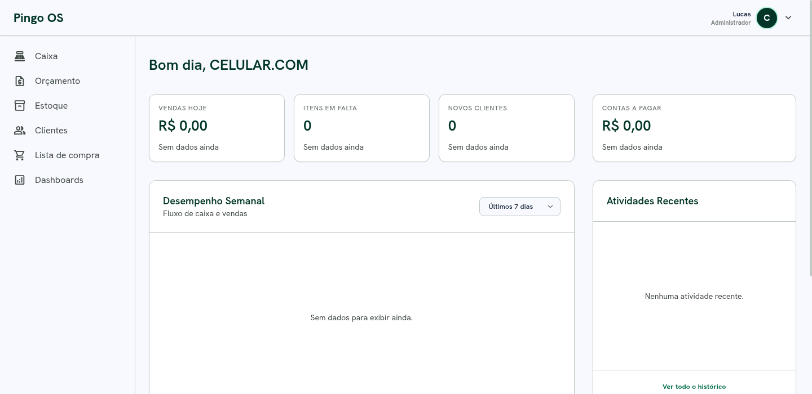
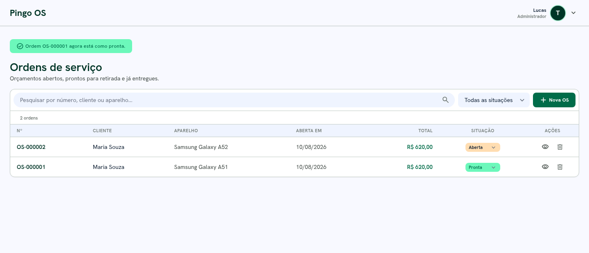
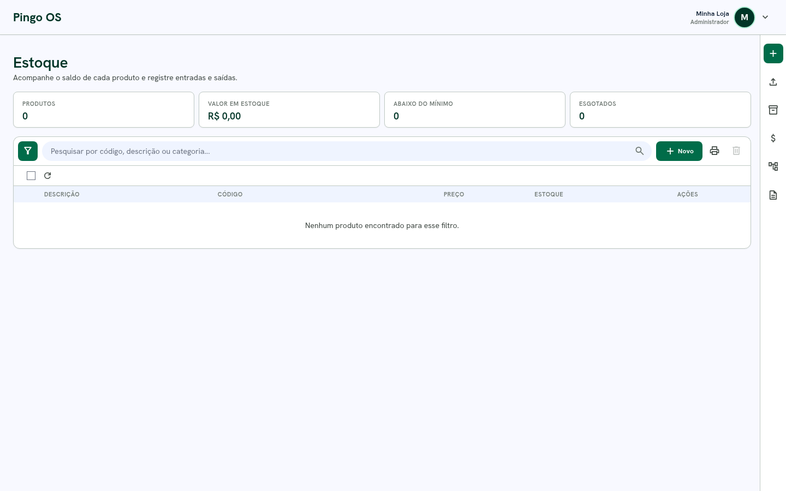
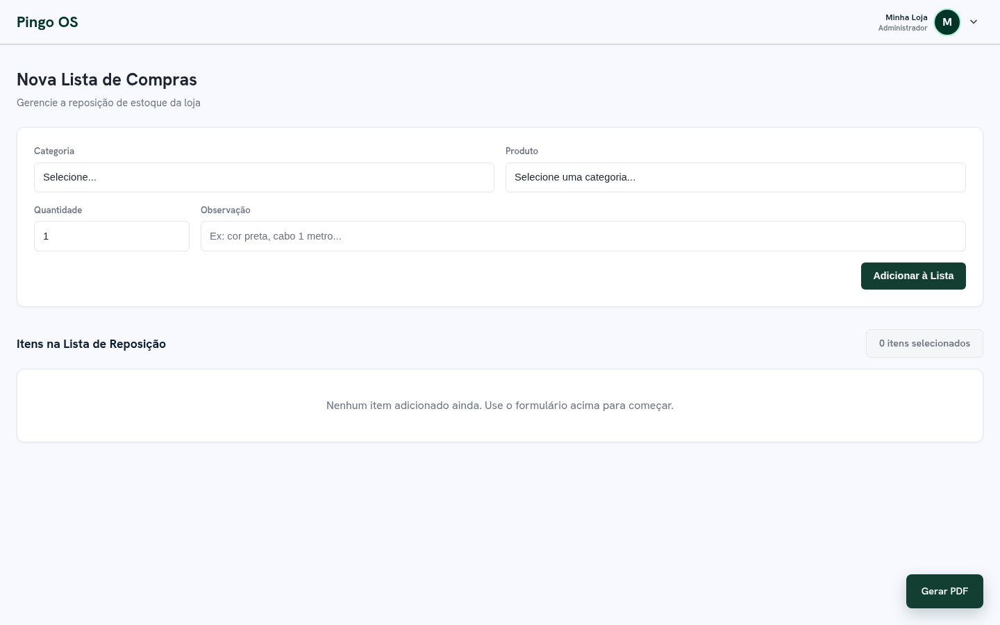
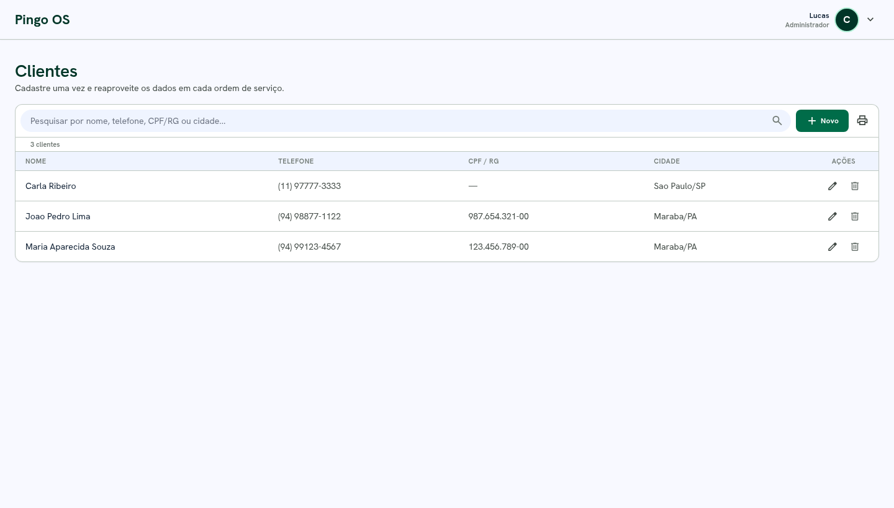
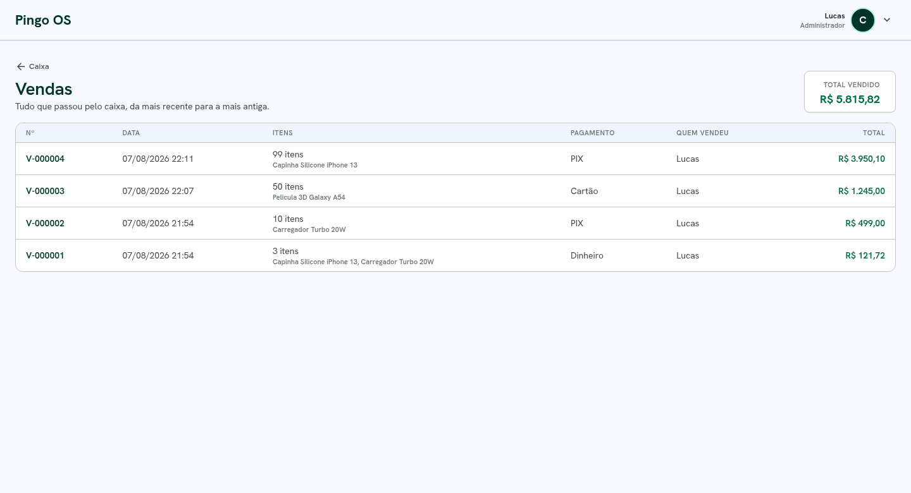
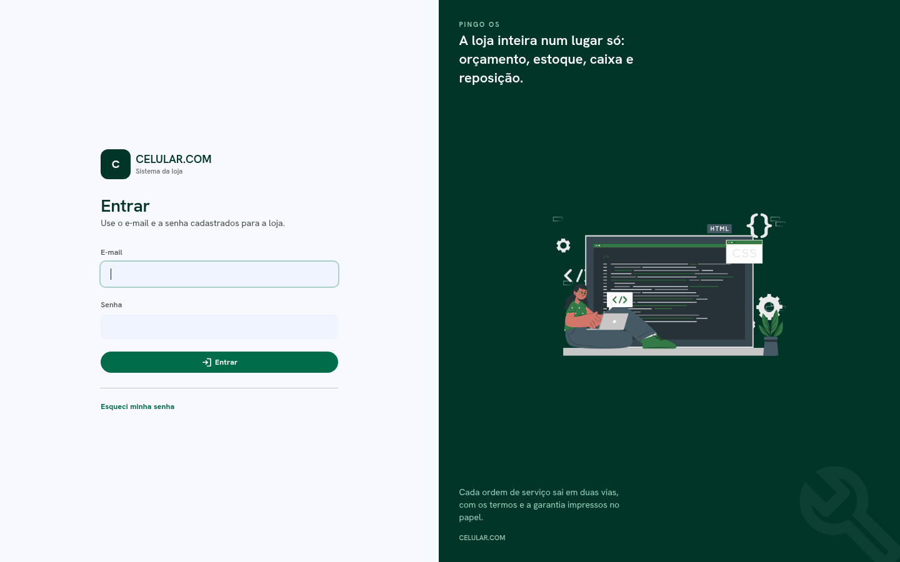
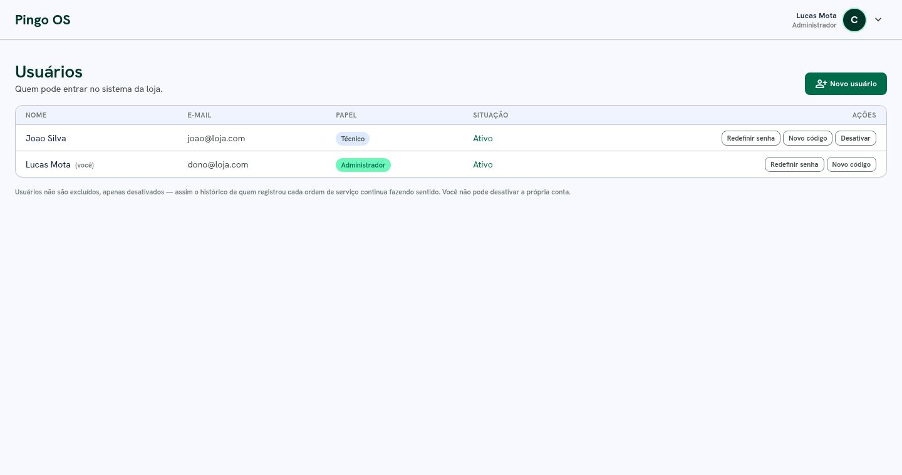

# Pingo OS

Sistema de gestão para loja de acessórios e assistência técnica de celulares. Começou como uma
lista de compras e está virando um ERP, módulo por módulo.




---

## Índice

- [Módulos](#módulos)
- [Telas](#telas)
- [Requisitos](#requisitos)
- [Instalação](#instalação)
- [Stack](#stack)
- [Estrutura do projeto](#estrutura-do-projeto)
- [Como adicionar um módulo](#como-adicionar-um-módulo)
- [Guia de alterações no banco de dados](#guia-de-alterações-no-banco-de-dados)
- [Licença](#licença)
- [Melhorias futuras](ROADMAP.md)

---

## Módulos

| Módulo | Controller | Rota | Status |
|---|---|---|---|
| Lista de compras | `ListaCompraController` | `/ListaCompra` | ✅ Completo — telas + banco + PDF |
| Configuração (perfil da loja) | `ConfiguracaoController` | `/Configuracao` | ✅ Completo — telas + banco |
| Clientes | `ClienteController` | `/Cliente` | ✅ Completo — telas + banco |
| Ordem de Serviço / Orçamento | `OrcamentoController` | `/Orcamento` | ✅ Completo — banco, até 5 aparelhos, pagamento e impressão em duas vias |
| Estoque | `EstoqueController` | `/Estoque` | ✅ Completo — telas + banco + histórico de movimentações |
| Caixa | `CaixaController` | `/Caixa` | ✅ Completo — venda gravada e baixa automática do estoque |
| Dashboards | `DashboardsController` | `/Dashboards` | 🚧 Placeholder "Em breve" |

Cada módulo é construído **por partes**: primeiro as telas, o **banco de cada módulo fica para
depois** — modelado com EF Core seguindo o mesmo esquema da Lista de Compras.

Todos os módulos com tela pronta persistem em banco. Só **Dashboards** segue como placeholder,
esperando dados acumularem.

## Telas

| Orçamento / OS | Estoque |
|---|---|
|  |  |

| Lista de compras | Clientes |
|---|---|
|  |  |

| Vendas | Login |
|---|---|
|  |  |

| Usuários |
|---|
|  |

### Ordem de Serviço

O módulo é o centro do sistema. Uma OS tem:

- **Cliente vindo do cadastro** — o campo Nome tem uma lupa que busca por nome, telefone ou CPF; os
  demais campos são preenchidos e ficam somente-leitura, garantindo que o papel bate com o cadastro.
- **Até 5 aparelhos na mesma ordem** — o cliente que deixa dois celulares na mesma visita é um
  atendimento só. O limite é o que cabe nas duas vias impressas.
- **Pagamento explícito** — haver (adiantamento) deixado pelo cliente, desconto em % ou R$, forma de
  pagamento e parcelamento, com as contas calculadas na tela enquanto se digita:

  ```
  Subtotal dos itens          R$ 800,00
  Desconto (10%)            − R$  80,00
  Haver deixado pelo cliente− R$ 200,00
  Falta pagar                 R$ 520,00     3x de R$ 173,33
  ```

- **Situação** Aberta → Pronta → Entregue, alterável em qualquer direção pela listagem ou pela
  própria OS. A data de entrega é a que conta para a garantia.
- **Numeração sequencial** (`OS-000001`) gerada no servidor e **autoria**: o nome de quem emitiu
  aparece na linha de assinatura do técnico.

#### A impressão

Sai com as **duas vias na mesma folha A4** (1ª do cliente, 2ª do técnico), separadas por linha de
corte, com o nome de cada parte sobre a respectiva linha de assinatura. Inclui os termos e
condições com as bases legais (CDC, LGPD, Código Civil): garantia de 90 dias, exclusão de mau uso,
sigilo sobre os arquivos pessoais do aparelho e prazo de retirada.

Se a ordem tiver muitos itens ou aparelhos, o documento se ajusta sozinho para caber em uma folha
(`ajustarEscala()` em `wwwroot/js/os-impressao.js`).

> O documento de impressão é montado a partir de `#osImpressao`, e **todo o CSS de impressão é
> escopado nesse id**. A 2ª via é um clone da 1ª feito por JavaScript — se ela sair sem formatação,
> procure por tag mal fechada que esteja encerrando o `#osImpressao` antes da hora.

## Requisitos

- [.NET SDK 10.0](https://dotnet.microsoft.com/download) ou superior
- `sqlite3` ou [DB Browser for SQLite](https://sqlitebrowser.org) — opcional, só para editar o banco à mão

Não precisa instalar servidor de banco: o SQLite é um arquivo, criado automaticamente.

## Instalação

```bash
git clone https://github.com/xymotaa/xypedidos.git
cd xypedidos/ListasCompras
dotnet restore
dotnet run
```

Acesse **http://localhost:5096** (ou https://localhost:7016).

Na primeira execução o sistema cria o banco `loja.db`, aplica as migrations e popula os dados
iniciais (categorias, marcas e modelos de celular) via `Data/SeedData.cs`.

Para configurar o nome, logo, CNPJ e endereço da loja — que aparecem no cabeçalho da OS e do PDF
— acesse **/Configuracao**.

### Como o acesso funciona

Todas as telas exigem login. Abrir `http://localhost:5096` sem sessão leva direto ao **login**, e
depois de entrar o sistema segue para o painel — ou para a página que a pessoa tentou abrir, se ela
tiver vindo de um link. A sessão dura 8 horas e renova enquanto o sistema está em uso, então o
expediente do dia seguinte começa pedindo login.

### Primeiro acesso e senhas

Na primeira vez que abrir, o sistema pede para criar a conta do responsável e nomear a loja.
Logo depois ele mostra um **código de recuperação** (formato `XXXX-XXXX-XXXX-XXXX`) **uma única
vez** — anote em papel. O sistema guarda só uma versão embaralhada dele; nem consultando o banco
dá para descobrir qual era.

- **Esqueci a senha:** na tela de login, "Esqueci minha senha". Informe o e-mail e o código
  (com ou sem hífen, maiúscula ou minúscula) e defina a nova senha. O código usado é queimado e um
  novo é entregue na hora.
- **Gerar um código novo:** menu do usuário → Usuários → "Novo código". O anterior deixa de valer.
- **Esqueci a senha E o código:** quem tem acesso ao computador da loja redefine pelo terminal:

  ```bash
  cd ListasCompras
  dotnet run -- redefinir-senha dono@loja.com novasenha123
  ```

  Depois entre no sistema e gere um código novo em Usuários. O comando também reativa a conta, se
  estiver desativada.

### Migrations

O `dotnet-ef` já está declarado como ferramenta local do projeto:

```bash
dotnet tool restore
dotnet dotnet-ef migrations add NomeDaMigration
```

As migrations são aplicadas sozinhas ao iniciar a aplicação (`db.Database.Migrate()` no `Program.cs`).

## Stack

| Camada | Tecnologia |
|---|---|
| Backend | ASP.NET Core MVC, .NET 10 |
| ORM | Entity Framework Core 10.0.9 |
| Banco | SQLite (`loja.db`) |
| Front das telas novas | Tailwind CSS via CDN, fonte Hanken Grotesk, Material Symbols |
| Front das telas antigas | `wwwroot/css/site.css` (verde institucional, fonte Inter) |
| PDF / impressão | Impressão do navegador + CSS `@media print` |

Sem jQuery, sem Bootstrap, sem build step de front-end.

> **Dois visuais convivem hoje.** As telas novas (Painel, Orçamento, Estoque, Caixa,
> Configuração) são autônomas com `Layout = null` e Tailwind. As telas antigas (Lista de compras,
> "Em breve") usam o `site.css` verde. É esperado por enquanto — unificar depois, se quiser.

## Estrutura do projeto

```
ListasCompras/
├── Controllers/       um controller por módulo, herdando de LojaControllerBase
├── Data/              AppDbContext + SeedData
├── Migrations/        migrations do EF Core
├── Models/            entidades e view models
├── Views/
│   ├── Home/          o Painel (tela inicial, com o menu lateral)
│   ├── <Modulo>/      Index lista · Add cria e edita · Ver mostra/imprime
│   └── Shared/        _Navbar, _HeadTailwind, _PainelIlustracao, EmBreve, _Layout, Error
└── wwwroot/
    ├── css/           site.css (telas antigas) e print.css (PDF da lista)
    ├── img/           ilustração da tela de login
    └── js/            um arquivo por tela (orcamento, os-lista, os-impressao, estoque...)

**Convenção das telas:** cada módulo segue `Index` (listagem com busca) → `Add` (formulário que
cria e edita, pelo `id`) → `Ver` quando há algo a exibir/imprimir. Cliente, Estoque e Orçamento
seguem esse padrão.
```

**Tela inicial (Painel)** — `Views/Home/Index.cshtml`, estilo dashboard Material-3: sidebar fixa
com os módulos, topbar com a marca da loja e menu do usuário, KPIs, gráfico e tabela de
orçamentos. Os KPIs mostram estado vazio ("Sem dados ainda") até os módulos terem banco.

**Navbar compartilhada** — `Views/Shared/_Navbar.cshtml`, incluída via
`@await Html.PartialAsync("_Navbar")` por todas as telas autônomas. Alterar a navbar = editar só
o partial.

**`_Layout.cshtml`** é usado apenas pela página de erro; todas as outras views definem
`Layout = null`.

## Como adicionar um módulo

### Transformar um "Em breve" em módulo real

1. No controller, troque o `View("EmBreve", ...)` por uma `Index()` que monta o view model e
   retorna a view própria.
2. Crie `Views/<Modulo>/Index.cshtml` — comece copiando uma tela Tailwind existente
   (`Views/Orcamento/Index.cshtml` é um bom molde) e inclua o `_Navbar`.
3. Modele as entidades e adicione a migration (veja a seção do banco abaixo).

### Adicionar um módulo totalmente novo

1. Crie `<Nome>Controller : LojaControllerBase` — a base injeta o `AppDbContext` e preenche os
   dados da loja no `ViewData` (`NomeLoja`, `LogoLoja`, `LojaCnpj`, `LojaEndereco`...).
2. Enquanto não houver tela, retorne o placeholder compartilhado:

   ```csharp
   return View("EmBreve", new ModuloEmBreveViewModel
   {
       Icone = "💵",
       Nome = "Caixa",
       Descricao = "Registre vendas e controle as entradas e saídas do dia.",
       Recursos = new() { "Abertura e fechamento de caixa", /* ... */ },
   });
   ```

3. Adicione o item na sidebar em `Views/Home/Index.cshtml` (copie um `<a>`, ajuste o ícone
   Material Symbols, o texto e o `asp-controller`).
4. Pronto — a rota `/{Controller}` já funciona pela rota padrão do `Program.cs`.

---

## Guia de alterações no banco de dados

O banco é um arquivo SQLite gerado na primeira execução com dados iniciais
(`ListasCompras/Data/SeedData.cs`). Como ainda não existe tela de administração para editar
categorias, produtos ou modelos de celular, essas alterações são feitas direto no banco.

> ⚠️ O seed só roda **uma vez**, quando o banco está vazio. Depois que já tem dados, editar
> `SeedData.cs` não muda nada — é preciso alterar o `loja.db` diretamente.

### Onde fica o banco

```
ListasCompras/bin/Debug/net10.0/loja.db
```

### Tabelas principais

| Tabela | Colunas | Descrição |
|---|---|---|
| `Categorias` | Id, Nome, RequerModelo | Categorias do dropdown (Capinha, Película, Cabo...). `RequerModelo` = 1 se a categoria exige selecionar marca/modelo do celular. |
| `Produtos` | Id, Nome, Descricao, CategoriaId | Itens vendidos, vinculados a uma categoria. |
| `MarcasCelular` | Id, Nome | Marcas (Samsung, Apple, Motorola, Xiaomi...). |
| `ModelosCelular` | Id, Nome, MarcaCelularId | Modelos (Galaxy A22, iPhone 13...), vinculados a uma marca. Um modelo cadastrado fica disponível para **qualquer** categoria com `RequerModelo = 1`. |
| `ListasCompra` / `ItensListaCompra` | — | A lista de reposição e seus itens. |
| `ConfiguracoesLoja` | — | Nome, logo, CNPJ, contato e endereço da loja. |

### Duas formas de editar

#### Opção A — Terminal (`sqlite3`)

1. Abra o banco:
   ```bash
   sqlite3 ListasCompras/bin/Debug/net10.0/loja.db
   ```
2. Rode o SQL desejado (exemplos abaixo) e confira com um `SELECT`.
3. Saia com `.quit` e recarregue a página no navegador (F5) — não precisa reiniciar o site.

Também dá para rodar um comando único sem entrar no modo interativo:

```bash
sqlite3 ListasCompras/bin/Debug/net10.0/loja.db "SELECT * FROM Categorias;"
```

#### Opção B — DB Browser for SQLite

```bash
sqlitebrowser ListasCompras/bin/Debug/net10.0/loja.db
```

1. Aba **Execute SQL**, cole o comando e execute (**▶** ou `Ctrl+Enter`).
2. Clique em **"Escrever modificações"** (Write Changes) — sem isso nada é salvo no arquivo.
3. Ao fechar, salve **por cima do arquivo original**, não em outro lugar.
4. Recarregue a página (F5).

> ⚠️ Com o DB Browser aberto o arquivo fica travado para escrita. Se o site tentar gravar ao
> mesmo tempo, dá `database is locked`. Feche o DB Browser antes de usar o site.

### Receitas de SQL

```sql
-- Renomear uma categoria
UPDATE Categorias SET Nome = 'Novo Nome' WHERE Nome = 'Cabo USB';

-- Nova categoria (RequerModelo = 1 se precisar de marca/modelo)
INSERT INTO Categorias (Nome, RequerModelo) VALUES ('Suporte Veicular', 0);

-- Novo produto numa categoria existente
INSERT INTO Produtos (Nome, CategoriaId)
VALUES ('Suporte Magnético', (SELECT Id FROM Categorias WHERE Nome = 'Suporte Veicular'));

-- Novo modelo de celular
INSERT INTO ModelosCelular (Nome, MarcaCelularId)
VALUES ('Galaxy A22', (SELECT Id FROM MarcasCelular WHERE Nome = 'Samsung'));

-- Nova marca
INSERT INTO MarcasCelular (Nome) VALUES ('Realme');

-- Renomear registros
UPDATE Produtos SET Nome = 'Capinha Transparente' WHERE Nome = 'Capinha Silicone';
UPDATE ModelosCelular SET Nome = 'Galaxy A23s' WHERE Nome = 'Galaxy A23';

-- Passar a exigir modelo numa categoria
UPDATE Categorias SET RequerModelo = 1 WHERE Nome = 'Suporte Veicular';

-- Remover
DELETE FROM Produtos WHERE Nome = 'Nome do Produto';
DELETE FROM ModelosCelular WHERE Nome = 'Galaxy A05';

-- Conferir
SELECT * FROM Categorias WHERE Nome LIKE '%Suporte%';
SELECT * FROM Produtos ORDER BY Id DESC LIMIT 5;

-- Ver o que um DELETE afetaria antes de rodar
SELECT COUNT(*) FROM ItensListaCompra WHERE ProdutoId =
  (SELECT Id FROM Produtos WHERE Nome = 'Nome do Produto');
```

> ⚠️ Apagar uma `Categoria` ou `Produto` que já tem itens vinculados apaga **em cascata** esses
> itens (`ON DELETE CASCADE`). O mesmo vale para `MarcasCelular` → `ModelosCelular`. Na dúvida,
> faça backup ou rode um `SELECT` antes.

### Backup

O banco é só um arquivo — copie antes de mexer:

```bash
cp ListasCompras/bin/Debug/net10.0/loja.db ListasCompras/bin/Debug/net10.0/loja.db.bak

# restaurar
cp ListasCompras/bin/Debug/net10.0/loja.db.bak ListasCompras/bin/Debug/net10.0/loja.db
```

### Erros comuns

| Erro | Causa provável |
|---|---|
| `database is locked` | O DB Browser está com o banco aberto ao mesmo tempo que o site. Feche um dos dois. |
| Alteração não aparece no site | Esqueceu de "Escrever modificações" no DB Browser, ou salvou o arquivo em outro lugar. |
| `FOREIGN KEY constraint failed` | `CategoriaId`/`MarcaCelularId` inexistente, ou tentativa de apagar um registro pai que ainda tem filhos. |
| Editou `SeedData.cs` mas nada mudou | O seed só roda com o banco vazio. Altere direto no `loja.db`. |

---

## Licença

Distribuído sob a **Licença Apache 2.0** — veja [LICENSE](LICENSE) para o texto completo.
Em resumo: você pode usar, modificar e redistribuir, inclusive comercialmente, desde que
mantenha o aviso de copyright e sinalize o que foi alterado.

Materiais de terceiros usados no projeto (ilustração, fontes e Tailwind) estão listados em
[NOTICE](NOTICE), com as respectivas licenças e atribuições.

> **Hospedagem por conta própria.** O sistema foi feito para rodar no computador da loja. Se você
> escolher hospedá-lo num servidor, a responsabilidade é sua: configure HTTPS, use senhas fortes e
> avalie a exposição dos dados pessoais dos clientes (CPF, endereço, telefone) que o sistema
> armazena.
